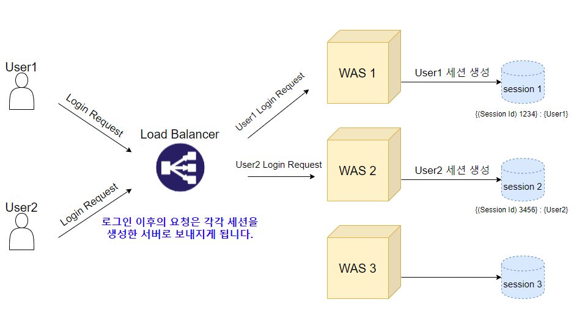

# 세션

출처: 스프링 MVC2 2편 - 인프런, 김영한

- 로그인을 세션으로 구현할 경우, 인증 과정에 세션 저장소를 조회하는 로직이 포함된다.
- 일반적으로 세션 저장소는 **메모리(RAM)**의 형태이다.
- 동시접속자가 많다면 세션 저장소에 트래픽이 집중될 수 있다.
- 트래픽을 분산시키기 위해 세션 저장소를 확장(scale-out)한다.

## 세션 불일치 해결방법 
- Sticky Session
- Session Clustering
- Session Storage 분리

 

**Sticky Session**

- 사용자가 처음 접속된 서버로 계속 접근하도록 트래픽을 처리하는 방식
- 특정 서버에 트래픽이 집중될 위험이 있다.

 

**Session Clustering**

- 세션 저장 정보가 변경될때마다 여러 서버의 세션 저장소를 동기화하는 방식
- 모든 서버의 세션 저장 정보를 동기화 해야하므로 서버 수에 비례하여 네트워크 트래픽이 증가한다.

 

**Session Storage 분리**

- Sticky Session의 문제점인 특정 서버에 트래픽이 집중되는 문제를 해결
- Session Clustering의 문제점인 동기화 작업으로 인한 트래픽 증가 현상이 발생하지 않음
- 외부 세션 저장소 서버를 일반적인 Disk-Based DB로 선택할 경우, 세션 정보를 조회하는 로직이 I/O 기반으로 동작하므로 성능이 떨어진다.
- 세션 정보는 영속성을 저장할 필요가 없기 때문에 Disk-Based DB를 선택할 필요가 없다.
- 따라서 외부 세션 저장소는 In-Memory DB를 선택한다.
- 일반적으로 Key-Value DB인 Redis, Memcached를 사용한다.

