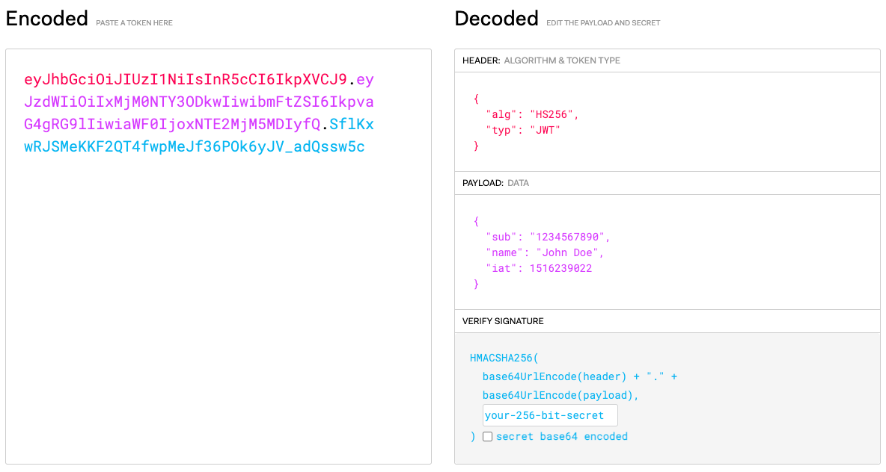
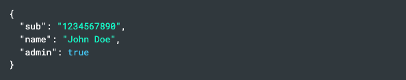

# 세션

출처: 스프링 MVC2 2편 - 인프런, 김영한

- 로그인을 세션으로 구현할 경우, 인증 과정에 세션 저장소를 조회하는 로직이 포함된다.
- 일반적으로 세션 저장소는 **메모리(RAM)**의 형태이다.
- 동시접속자가 많다면 세션 저장소에 트래픽이 집중될 수 있다.
- 트래픽을 분산시키기 위해 세션 저장소를 확장(scale-out)한다.

## 세션 불일치 해결방법 
- Sticky Session
- Session Clustering
- Session Storage 분리

 

**Sticky Session**

- 사용자가 처음 접속된 서버로 계속 접근하도록 트래픽을 처리하는 방식
- 특정 서버에 트래픽이 집중될 위험이 있다.

 

**Session Clustering**

- 세션 저장 정보가 변경될때마다 여러 서버의 세션 저장소를 동기화하는 방식
- 모든 서버의 세션 저장 정보를 동기화 해야하므로 서버 수에 비례하여 네트워크 트래픽이 증가한다.

 

**Session Storage 분리**

- Sticky Session의 문제점인 특정 서버에 트래픽이 집중되는 문제를 해결
- Session Clustering의 문제점인 동기화 작업으로 인한 트래픽 증가 현상이 발생하지 않음
- 외부 세션 저장소 서버를 일반적인 Disk-Based DB로 선택할 경우, 세션 정보를 조회하는 로직이 I/O 기반으로 동작하므로 성능이 떨어진다.
- 세션 정보는 영속성을 저장할 필요가 없기 때문에 Disk-Based DB를 선택할 필요가 없다.
- 따라서 외부 세션 저장소는 In-Memory DB를 선택한다.
- 일반적으로 Key-Value DB인 Redis, Memcached를 사용한다.

---

# JWT
- JWT (JSON Web Token)는 당사자간에 정보를 JSON 객체로 안전하게 전송하기 위한 표준 ([RFC 7519](https://www.rfc-editor.org/rfc/rfc7519))
- 정보는 공개 / 개인키 쌍을 사용하여 디지털 서명을 하기 때문에 신뢰할 수 있습니다. 

## 구조

- Header
- Payload(데이터)
- Signature

 

**Header**

- `alg`: 서명 알고리즘
- `typ`: 토큰 타입
- 헤더 정보는 **Base64Url** 방식으로 인코딩되어 JWT의 첫 번째 구성값이 된다.
- Base64란 8비트 이진 데이터를 ASCII 문자로 바꾸는 인코딩 방식이다.

**Payload**

- 클레임(전달하고싶은 정보)를 포함하는 데이터
- 세 가지 타입의 클레임이 있다.
  - Registered claims:
    - 사용하길 권장하는 미리 정의된 클레임 집합.
    - iss(발행자)
    - exp(만료시간)
    - sub(주제)
    - aud(청중)
    - [기타](https://www.iana.org/assignments/jwt/jwt.xhtml)
  - Public claims
    - JWT를 사용하는 사람들이 원하는대로 정의
    - 충돌을 피하기 위해서 [링크](https://www.iana.org/assignments/jwt/jwt.xhtml)에 정의된 것을 사용
    - 또는 충볼 방지 네임스페이스를 포함하여 정의
  - private claims
    - 당사자간에 정보를 공유하기 위한 클레임

**서명**

- 서명을 통해 무결성을 검증

## JWT 토큰을 이용한 인증 구현

1. **로그인 요청**
- 사용자가 서버에게 아이디, 비밀번호를 전달하며 로그인 요청을 한다.
2. **검증 및 JWT 토큰 생성**
- 서버는 사용자로부터 전달받은 아이디, 비밀번호를 바탕으로 인증 절차를 수행한다.
- 유효한 사용자라면 서버는 JWT 토큰을 생성한다.
3. **JWT 토큰 전달**
- 사용자에게 JWT 토큰을 전달한다.
- JWT 토큰은 사용자 웹 브라우저의 웹 스토리지 영역에 저장된다.
4. **API 호출**
- 사용자는 쿠키에 JWT 토큰을 담아 서버의 API를 호출한다.
- 서버는 사용자로부터 전달받은 JWT 토큰이 유효한지 검증한다.
- 만일 유효한 토큰이라면 API를 호출하고 사용자에게 응답한다.

## 세션-인증방식의 문제를 해결
- JWT 토큰을 이용한 인증은 세션의 문제를 해결할 수 있다.
- 세션을 이용한 인증 방식의 문제는 서버 확장에 한계가 있다는 점이다. 서버간 세션 정보의 불일치가 발생할 수 있기 때문이다.
- JWT 토큰을 이용한 인증 방식은 세션 저장소와 같은 개념이 필요없기 때문에 서버를 무한히 확장할 수 있다.
# Reference
- [시큐리티 특강, Youtube 메타코딩 채널](https://www.youtube.com/@metacoding)
- https://jwt.io/introduction
